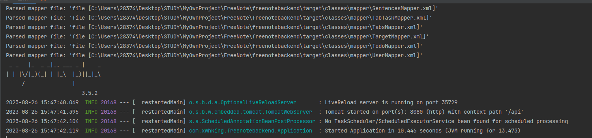

# 项目介绍
## 项目名称
> # FreeNote 自由记
## 项目功能介绍
- TODO
  - 可以记录当天的TODO 对当天的TODO可以进行完成和删除
  - 可以查看历史TODO
    - 历史TODO可以按照标题搜搜
    - 可以按照日期搜索
    - 可以删除
- 目标规划
  - 能够创建目标规划
  - 能够删除
  - 能够搜索通过标题和内容
  - 能够查看目标规划详情
  - 可以编辑规划
- 习惯
  - 可以创建自己的习惯
  - 习惯可以点击查看详情
    - 详情内有对习惯的统计
    - 可以打卡
  - 可以编辑
- 其他栏目
  - 在这个栏目中可以自己创建一个标签，记录相应的事情
  - 可以创建多个标签
    - 对应的标签可以创建任务，记录
      - 记录是可以完成的
      - 可以删除
  - 也可以删除标签
  - Freedom
- 有一句话栏目
  - 这个其实就是个冗余功能吧 ，就是吧一言的那些一句话收集到数据库，然后展示出来
- 登录的时候会有每日一句话
  - 展示每日的一句话有英文、中文、背景图

## 为什么要做这个项目
1. 在用MicrosoftTODO的时候，记录了每天的TODO，然后记录完了第二天去查看的时候不能看是什么时候创建，这很烦，所以就做了这个项目， 主要主要就是可以查看日期，知道自己那天做了些什么。
2. 希望有个能够记录习惯打卡的地方
3. 能够记录自己的目标规划等
4. 能够有一定的记录拓展性，所以有其他这个栏目

## 项目使用技术

本项目采用前后端分离

### 前端
- vue3 [官网](https://cn.vuejs.org/)
- vite打包 [vite官网](https://vitejs.cn/vite3-cn/guide/)
- ant design vue [antdv组件官网](https://www.antdv.com/components/overview)
- axios [Axios官网](https://www.axios-http.cn/docs/intro)
- vueRouter [Vue-Router官网](https://router.vuejs.org/zh/)
- vue-markdown-editor [官网](https://code-farmer-i.github.io/vue-markdown-editor/zh/)
- 日历贡献图 [开源网址Vue3](https://github.com/razorness/vue3-calendar-heatmap) [Vue2](https://github.com/julienr114/vue-calendar-heatmap)

### 后端
- Spring Boot 2.7.10
- mybatisPlus 
- 邮箱注册验证 
- 图片验证 
- swagger + knife4j 接口文档
- Gson json格式转化 
- mysql 8.+
- Lombok
- 长整数丢失精度解决
- 全局异常处理器
- 自定义错误码
- 封装通用响应类

#### 后端可优化的点
- [ ] 使用Redis 来缓存数据， 分布式登录
- [ ] 优化代码逻辑
- [ ] 每次进行API请求的登录验证可以总体抽出来
- [ ] 待发现的优化点

### 拓展
- 管理系统
  - 可以用户管理
  - 所有内容进行管理
- 手机APP
  - 能够不局限于在电脑上用能够在手机上去适配

# 项目如何启动
## 后端
[后端项目地址](https://gitee.com/zouwxh/freenotebackend-open)
1. 下载后端代码
2. 修改数据库连接账号密码以及数据库
3. 建立相应数据库表
4. 配置邮箱账号和授权码
5. 然后启动类启动

## 前端
[前端项目地址](https://gitee.com/zouwxh/freenotefrontendpc)
> npm install 下载依赖

> npm run dev 启动项目

# 项目运行效果展示
## 后端

### 运行

### 接口文档

## 前端

### 运行

### 登录

### 注册

#### 注册时的邮箱验证

### TODO

### 习惯

### 目标规划

### 个人中心

### 其他

